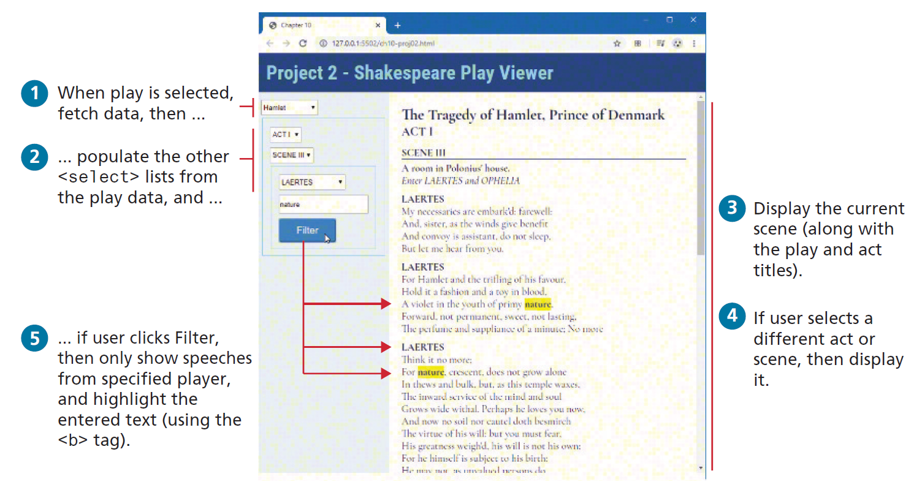

# In-class Web API activity003

## Forking this repo (BLAH BLAH BLAH ... the same verbiage as earlier)
To work on this project, you will need to create a personal copy of the repository. This is done by forking it. Follow these steps:
### 1. Fork repository
- Click the “Fork” button located in the upper right corner of the repository page.
- This will create a copy of the repository under your GitHub account. (only one in the project will do this!)
### 2. Clone Your Fork
- On your GitHub account, navigate to your forked repository.
- Clone the forked repository to your local machine.
### 3. Adding Collaborators
- Add your project members in the same way as you would for a normal repository.
- Go to `Settings`, `Collaborators` to add members to this repo.
### 4. New branch
- ***VERY IMPORTANT*** -> Create a new branch before you make any changes to the forked repo!!
- Once the branch is created, make the changes as per project requirements.
- You can make as many commits and as many pushes as needed to that branch that was newly created.
- To be consistent, use the same styling for commit messages that was given in the Project I.
    - [Prefix] – [Short description of the change]
      The following are the only possible options for [Prefix]:
    - [FEAT] - For new features or major additions to the project.
        - Example: `FEAT - Added contact form to the Contact page`
    - [FIX] - For bug fixes, corrections, or revisions to the code.
        - Example: `FIX - Corrected navigation bar alignment on mobile devices`
    - [STYLE] - For stylistic changes such as formatting, CSS modifications, or minor visual updates.
        - Example: `STYLE - Updated color scheme for better contrast`
    - [DOCS] - For changes or additions to the documentation, including README files and comments in the code.
        - Example: `DOCS - Added project description and setup instructions to README`
    - [SECURITY] - For changes related to improving the security of the website.
        - Example: `SECURITY - Implemented input validation for contact form`
    - [REFACTOR] - For code refactoring that doesn’t change functionality but improves code quality or organization.
        - Example: `REFACTOR - Organized CSS files and cleaned up redundant styles`
    - [TEST] - For adding tests or making changes to the testing suite.
        - Example: `TEST - Added validation tests for contact form input`

### 5. Submitting your work
Once, you are sure that all the work is completed, go through the following steps for submission.
- Go to your forked repository on GitHub.
- Click on the “Pull requests” tab and then the “New pull request” button.
- Select the branch you pushed your changes to.
- Click “Create pull request” and provide a title and description for your changes.
- Submit the pull request.
- If you have made a pull request on error or have made further changes to the branch, you can always close the pull request that was made and make a new pull request.
- The closest pull request to the due date will be reviewed.

### 6. Grading and Feedback
- After the submission deadline, your pull request will be reviewed.
- Feedback and grades will be provided based on the changes made and the quality of the work.

Not sure, how to create a pull request, check this [link](https://docs.github.com/en/pull-requests/collaborating-with-pull-requests/proposing-changes-to-your-work-with-pull-requests/creating-a-pull-request-from-a-fork).

# Project description
This project focuses on array functions and
prototypes/classes/modules, it also uses fetch to retrieve data. Figure below indicates what the final result should look like in the browser.
You have been provided with the necessary styling and markup already, all the files needed are present in the repo.

1. Examine webapiactivity.html in the editor of your choice. Notice the
   containers for the fetched data in the `<aside>` and `<section>` elements.
   Notice the sample markup for the play data. This will be eventually
   commented out and replaced with JavaScript code that programmatically
   generates this markup.
2. Examine `webapiactivity.js` in the editor of your choice. In it, you will see the
   URL for the external API that will provide the color scheme data. Examine
   this URL in the browser in order to see the structure of the data. A
   Shakespeare play contains multiple acts; each act contains multiple scenes. (To
   reduce the size of the downloaded files, not all acts and scenes have been
   included).
3. Add a change event handler to the first `<select>`, which contains a preset list
   of plays. When the user selects a play, fetch the play data by adding the value
   attribute of the `<option>` for the play as a query string, as shown in the
   comments in webapiactivity.js. When the fetched play is retrieved, populate the
   three other `<select>` elements from this data. Also populate the `<section id="playHere">`, `<article id="actHere">`, and `
`
   elements with the first scene from the first act of the selected play.
4. To make the code more manageable, create classes named `Play`, `Act`, and
   `Scene`, which will be responsible for outputting the relevant DOM elements.
   Using object-oriented techniques, the `Play` class will contain a list of `Act`
   objects, the `Act` class will contain a list of `Scene` objects, while the `Scene`
   class will contain a list of speeches. These classes will reside within a
   JavaScript module named `play-module.js`.
5. Add event handlers to the other `<select>` elements. They will change what
   part of the play is displayed.
6. The filter button will highlight all occurrences of the user-entered text in the
   play and only show the speeches from the specified player.

## Tips and Suggestions
* Start small: Break this problem down into smaller steps. First verify the fetch works,
  perhaps with a simple `console.log` statement. Then populate the `<select>`
  lists based on the fetched data.
* You may decide to move your code into classes within your module after you
  finished your code, or you may decide to work with classes and modules right
  from the start.
* **DON’T USE ABSOLUTE PATHS**. Use only relative paths in your project files. This practice is particularly important when multiple people are working on the same project, as it ensures that links and references work correctly across different environments and systems.
* Iterate and Test: Continuously test your website after making necessary changes.
* Issues: Use the GitHub to create Issues and track the status of the issues using Milestones.
* Focus on Details: Pay attention to small details like spacing, hover effects, to create a polished final product.

